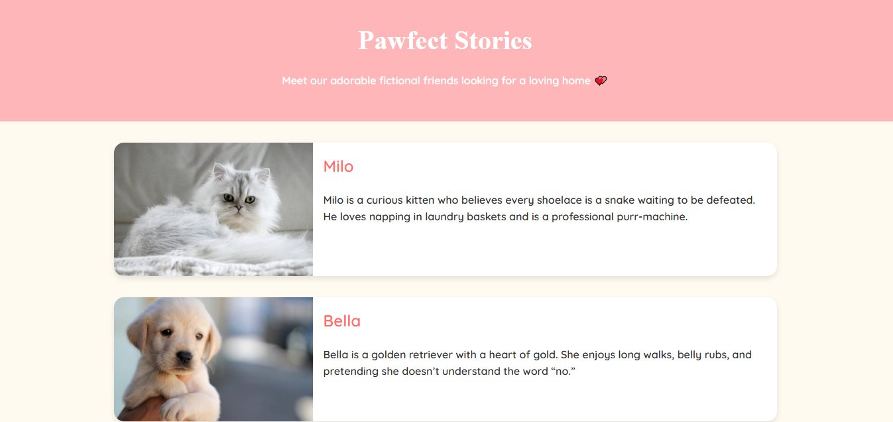

# 🐾 Pet Adoption Website (Pawfect Stories)

**Pawfect Stories** is a fun, fictional single-page website showcasing adorable pets “up for adoption” with short stories and cute images.  
*Note: This is a fictional project — no real adoptions take place.*

## 🌟 Features
- Whimsical and colorful design.
- Cute fictional stories for each pet.
- Fully responsive layout.
- Static website — deployable for free via GitHub Pages.

## 📸 Preview

## 🚀 Deployment
The main aim of creating this project was to **deploy a static website using GitHub Pages**.  

## 📂 Project Structure

The project includes:

- **`index.html`** — Main HTML file containing the structure and embedded JavaScript.
- **`style.css`** — Stylesheet for the website.
- **Logo & Pet Images** — Used throughout the site for branding and visual appeal.
- **JavaScript** — Included directly inside `index.html` for interactivity.